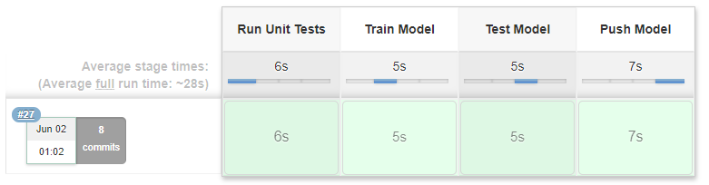
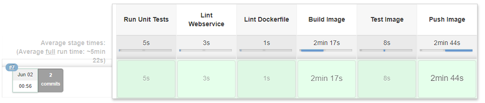
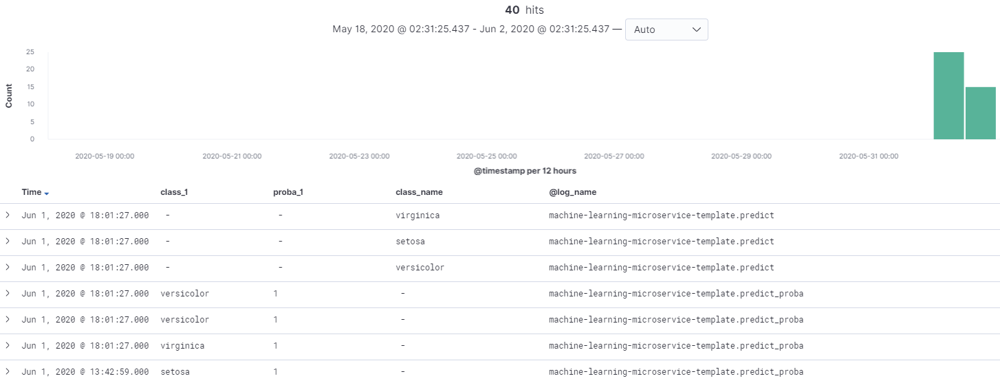

# machine-learning-microservice-template (Version 0.1.0)

## Project
The goal of this project is to propose a machine learning template for simple machine learning use cases.
Furthermore, this project serves as capstone project to Udacity's Cloud DevOps Nanodegree.

## Motivation
Typical roles which are involved in devoloping and deploying a machine learning model are Data Engineers, Data Scientists and ML-Engineers.
Data Engineers connect different data sources and make the data easily accessible to the Data Scientist, who uses the Data to develop the final model architecture. After the Data Scientist is happy with the performance of the model, it is ready to be deployed to production. The ML-Engineer then takes the model and bakes it into a web service and deploys it to production.  

  
*Machine Learning Lifecyle (heavily inspired by [uber](https://mc.ai/doing-machine-learning-the-uber-way-five-lessons-from-the-first-three-years-of-michelangelo/))*

It's assumed that the Data Scientist want to get his/her data in an easy way without thinking to much how the data are actually accessed.
The ML-Engineer in turn probably don't want to know every detail about the architecture of the given machine learning model.
So, there must be an interface between each of this roles, which hides the internal working of the former roles working result.
Proposing these interfaces is one of this projects goals.

When it comes to deploying a machine learning model, it shouldn't matter if the model predict dog races, types of flowers or anything else. There must be some processes which train the model, embed the model into a web service, build a docker image and deploy this image to a production environment.
The second goal of this project is to build a reusable pipeline which deploys the model to production.

## ToDo's
- [x] add example / walkthrough
- [ ] rework ansible commands (remove passwords/ use vault)
- [x] move config.yml from jenkins/ to projects root to serve as project configuration file
- [x] add basic logging functionality
- [x] add utilities (e.g. for deploying the mongodb required for logging) 
- [x] remove dummy files
- [x] create pydantic classes dynamically from yaml files
- [ ] add tests
    - [X] api tests
    - [x] data pipeline
    - [x] model class
    - [x] preprocessor
    - [x] funcs that should be implemented by the user
    - [ ] logging
    - [ ] update jenkins pipelines to run pytest

## Files & Folders
**ansible**: contains all files, which are required to setup the initial infrastructure  
**dockerfiles**: contains Dockerfiles and build scripts to build a runtime image which is used in the deployment pipelines and the production image which  contains the final web service  
**docs**: contains files/images used for documentation  
**helm**: contains a helm chart, which is used to deploy the web service to a kubernetes cluster. Since the goal is to create a reusable template, the k8s ressources should not be hard-coded into a yaml file. Helm brings a template engine which gives the possibility to use Variables which could be stored in a central project configuration file.  
**jenkins**: contains all Jenkinsfiles and required helper files which are needed during each stage  
**model_bin**: contains the model binary  
**tests**: contains test requests  
**source**: contains the source code to build the model  
**main.py**: the web service  

## Infrastructure
  
**Github**: The single source of truth. Here, all project related file are stored (source code but also configuration files, dockerfiles, helm charts, build scripts, and so on)  
**Jenkins**: Jenkins is used as CI/CD Tool.  
**Docker Hub**: Every artifact, which is build within the Jenkins pipeline should be stored in a central registry. For docker images Docker Hub is used.  
**Ansible**: A configuration management tool. Here, it is used to set up a Microk8s cluster on the target machine.  
**Helm**: Helm is the package manager for kubernetes. It also brings a templating engine, which gives us the possibility to use variables in the k8s ressource definition files. This way it is possible to use variables from a central configuration file.    
**Kubernetes**: k8s is used as deployment target for the final docker image.  

## Getting Started  
Below we will walk through how to train a ML model, build a webservice around it and log its predictions via EFK stack.
This template already contains a minimal working example. So you don't have to fill in your own code to follow this walkthrough.  
Each code snipped, which belongs to this example, is marked with  
```
# Example  
...  
# End Example  
```
### Fill in your code
The following classes and functions must be implemented or completed:
- DataLoader (source/data/data_loader.py)
- Preprocessor (source/model/train.py)
- train_model (source/model/train.py)
- get_classes (source/model/train.py)
- features.yaml (source/model/features.yaml)
- config.yaml (root dir)

The DataLoader's load_data method must return single DataFrame containing all the data, which are used during the training process.  
Preprocessor is a class, which helps to transform the raw DataFrame into a processed DataFrame, which can be used by a machine learning algorithm. It also stores Encoders/Vectorizers so they can later be used to transform incoming requests. If preprocessing steps are required, they must go into the Preprocessor.  
train_model is a function which takes the processed data as arguments and returns a trained model.  
If the ml-model is a classifier, the get_classes function must be implemented. The known classes are used when predicting probabilities. The probabilities are returned together with their corresponding class names.  
In features.yaml you must provide a list of features, which are used for training the model. This list is necessary to know which request parameters are required.  

### Start the Web Service locally
If you like, you can just start your service locally.  
```
cd getting-started
./start_local_service.sh
```
Now you should be able to test your running service.  
Visit: localhost:5000/docs

### Set up the required infrastructure
#### Start Jenkins  
```
cd getting-started
./start_jenkins.sh
```
#### Deploy the EFK-Stack  
```
git clone https://github.com/FlorianBorn/devops-playground.git
cd devops-playground/efk-stack/getting-started/
docker-compose up -d
```

### Build your image and log some predictions
#### Build the runtime Image
```
cd dockerfiles/runtime-image/
./build.sh <your docker repo>/<image name> <image tag>
docker push <your docker repo>/<image name>:<image tag>
```

#### Enable logging
This template comes with two logging functionalities, which both are disabled by default.  
To enable logging via EFK, set *enable_fluentd_logging* to True. The config file is located at the projects root directory.  
This will log every prediction made by our model.  

If you want to calculate your models performance later, you will likely need some IDs for your predicted entity. If you set the *ID_NAME* parameter to an arbitrary name, the web api adds this to its expected parameters and will also add its value to the log message. In addition each model object has a UUID and a timestamp for when it was created. These values are also always added to each log message.

#### Build the project via Jenkins
If you just started the Jenkins server, you probably have to configure it first. After this is done, you are ready to create the jenkins pipelines.
Create 2 pipelines which connect to your SCM of choice (where you store your project).  
In the pipeline configuration set the parameter Script Path to: **jenkins/train-model/Jenkinsfile** (model training) and **jenkins/build-image/Jenkinsfile**.  
If you see permission errors when running these pipelines, try to disable Lightweight checkout.  

On success, you should see the results below:   
  
*The model was trained successfully*  


  
*The docker image was build successfully*  

#### Start your web service
```
docker pull <your docker repo>/<image name>
docker run -p 8000:8000 <your docker repo>/<image name>
```
Your new and shiny web service should now be up and running.  
You can visit its built-in documentation under **localhost:8000/docs**  

#### Test your web service and view its logs
By now you should have a running Jenkins server, a running EFK stack and your model wrapped in a running docker image.  
If you go to **localhost:8000/docs** you can test your model. Make some dummy requests, so that there are some logs that you can view in Kibana.  

The FluentD you deployed earlier is configured to send every message to an index of format *fluentd-YYYYMMDD*. So, if you test this on the 2th June 2020, the index where your log will go is called *fluentd-20200602*. Afterwards you should create an index pattern in Kibana. This pattern could be *fluentd-\** or  *fluentd-20200602* for that specific index.  
After you have created a pattern, you can watch you prediction logs under the Discover tab.
  
*Example prediction logs* 