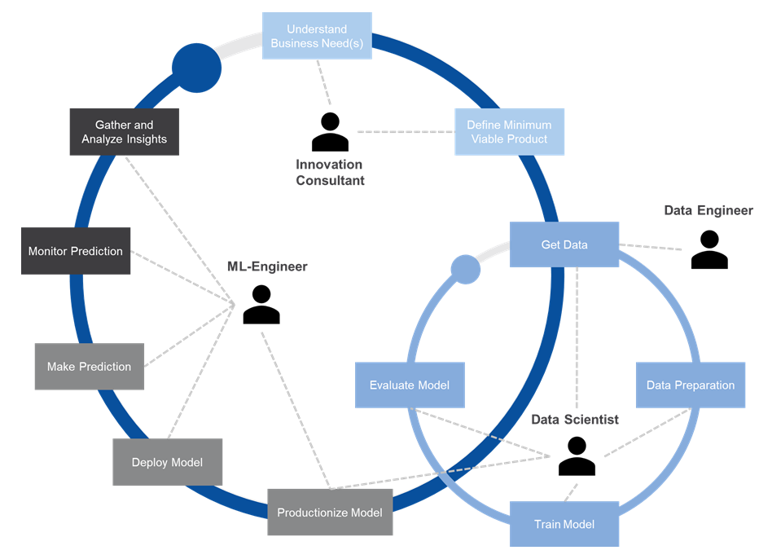
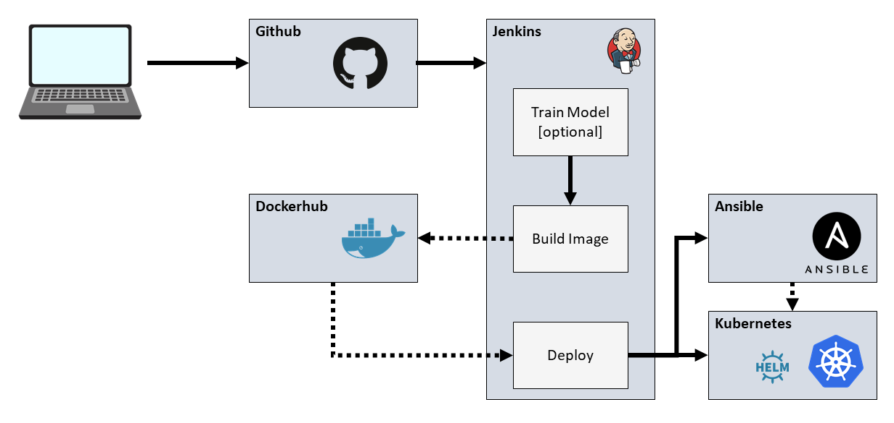

# machine-learning-microservice-template (Version 0.1.0)

## Project
The goal of this project is to propose a machine learning template for simple machine learning use cases.
Furthermore, this project serves as capstone project to Udacity's Cloud DevOps Nanodegree.

## Motivation
Typical roles which are involved in devoloping and deploying a machine learning model are Data Engineers, Data Scientists and ML-Engineers.
Data Engineers connect different data sources and make the data easily accessible to the Data Scientist, who uses the Data to develop the final model architecture. After the Data Scientist is happy with the performance of the model, it is ready to be deployed to production. The ML-Engineer then takes the model and bakes it into a web service and deploys it to production.  

  
*Machine Learning Lifecyle (heavily inspired by [uber](https://mc.ai/doing-machine-learning-the-uber-way-five-lessons-from-the-first-three-years-of-michelangelo/))*

It's assumed that the Data Scientist want to get his/her data in an easy way without thinking to much how the data are actually accessed.
The ML-Engineer in turn probably don't want to know every detail about the architecture of the given machine learning model.
So, there must be an interface between each of this roles, which hides the internal working of the former roles working result.
Proposing these interfaces is one of this projects goals.

When it comes to deploying a machine learning model, it shouldn't matter if the model predict dog races, types of flowers or anything else. There must be some processes which train the model, embed the model into a web service, build a docker image and deploy this image to a production environment.
The second goal of this project is to build a reusable pipeline which deploys the model to production.

## ToDo's
- [ ] add example / walkthrough
- [ ] move the example code to a separate branch
- [ ] rework ansible commands (remove passwords/ use vault)
- [x] move config.yml from jenkins/ to projects root to serve as project configuration file
- [x] add basic logging functionality
- [ ] add utilities (e.g. for deploying the mongodb required for logging) 
- [x] remove dummy files
- [ ] create pydantic classes dynamically from yaml files

## Files & Folders
**ansible**: contains all files, which are required to setup the initial infrastructure  
**dockerfiles**: contains Dockerfiles and build scripts to build a runtime image which is used in the deployment pipelines and the production image which  contains the final web service  
**docs**: contains files/images used for documentation  
**helm**: contains a helm chart, which is used to deploy the web service to a kubernetes cluster. Since the goal is to create a reusable template, the k8s ressources should not be hard-coded into a yaml file. Helm brings a template engine which gives the possibility to use Variables which could be stored in a central project configuration file.  
**jenkins**: contains all Jenkinsfiles and required helper files which are needed during each stage  
**model_bin**: contains the model binary  
**tests**: contains test requests  
**source**: contains the source code to build the model  
**main.py**: the web service  

## Infrastructure
  
**Github**: The single source of truth. Here, all project related file are stored (source code but also configuration files, dockerfiles, helm charts, build scripts, and so on)  
**Jenkins**: Jenkins is used as CI/CD Tool.  
**Docker Hub**: Every artifact, which is build within the Jenkins pipeline should be stored in a central registry. For docker images Docker Hub is used.  
**Ansible**: A configuration management tool. Here, it is used to set up a Microk8s cluster on the target machine.  
**Helm**: Helm is the package manager for kubernetes. It also brings a templating engine, which gives us the possibility to use variables in the k8s ressource definition files. This way it is possible to use variables from a central configuration file.    
**Kubernetes**: k8s is used as deployment target for the final docker image.  
